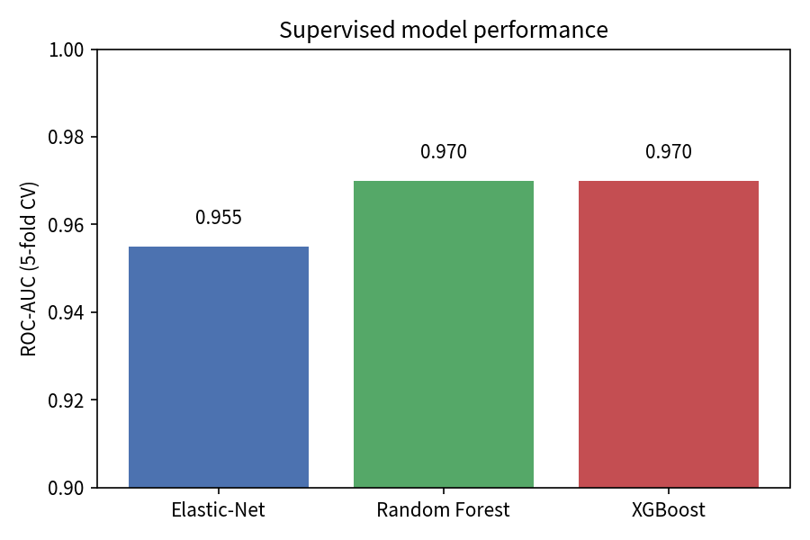
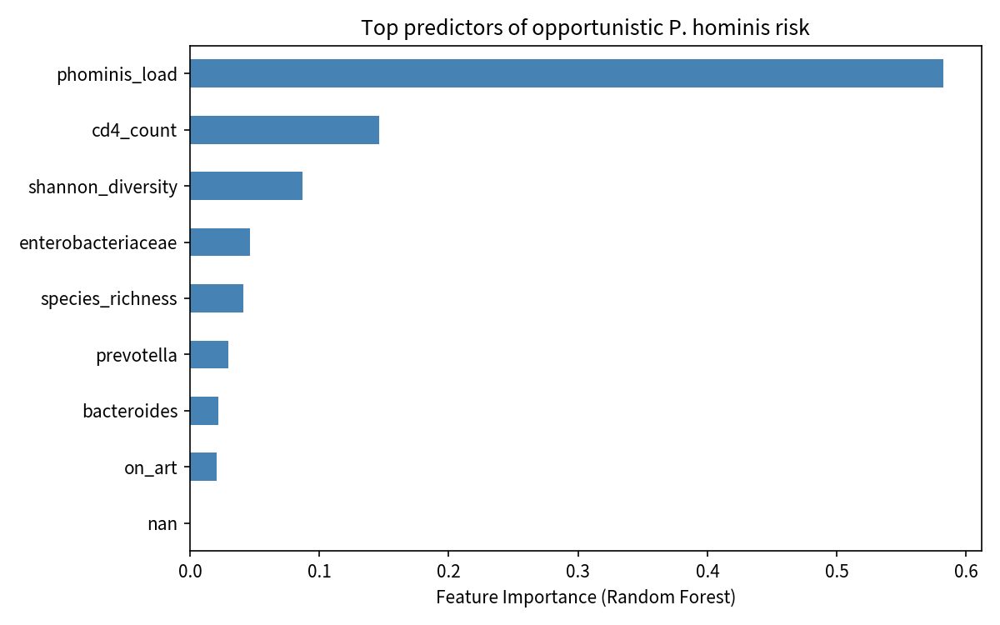
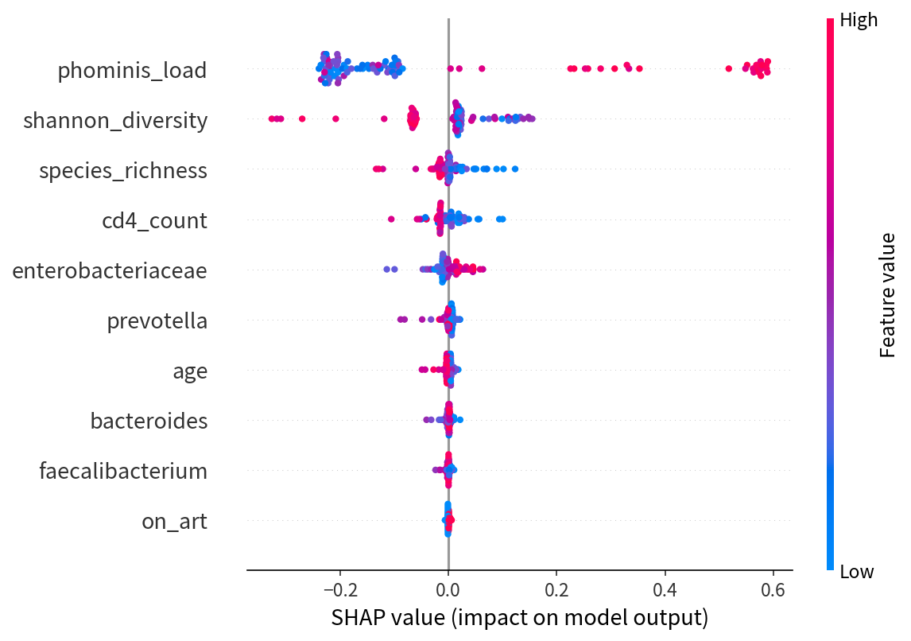

# Multi-Omics Pipeline for Detection & Characterization of *Pentatrichomonas hominis* in Immunocompromised Gut Microbiomes

Demonstrating end-to-end data engineering, custom pathogen detection, reproducible workflows, and machine learning applied to a real neglected opportunistic protozoan.

[](LICENSE)
[](https://www.nextflow.io/)
[]()

---

## Scientific Motivation

*Pentatrichomonas hominis* (formerly *Trichomonas hominis*) is a flagellated protozoan frequently dismissed as a commensal. Emerging evidence suggests it may act as an **opportunistic pathogen** in immunocompromised hosts (HIV/AIDS, transplant recipients, chemotherapy patients), contributing to chronic diarrhea and gut dysbiosis.  

This project builds a production-grade, open-source pipeline that:

1. Detects *P. hominis* (and related trichomonads) with high sensitivity in shotgun metagenomes using a **custom genome + marker database**.
2. Quantifies load and co-occurrence patterns.
3. Links microbial features to host immune status via supervised and unsupervised machine learning.
4. Provides fully reproducible Nextflow workflows ready for institutional HPC or cloud.

**Key knowledge gap addressed**: Is *P. hominis* truly enriched and pathogenic in immunocompromised guts, or merely a passenger?

---

## Repository Structure

```
phominis-multiomics-pipeline/
├── README.md                          # This file
├── LICENSE
├── environment.yml                    # Conda environment
├── Dockerfile                         # Optional container
├── config/
│   └── params.yaml                    # Pipeline parameters
├── data/
│   ├── genomes/
│   │   └── Phominis_Hs3NIH.fna        # Real genome (GCA_047301545.1)
│   ├── markers/                       # Real ITS / 18S sequences
│   └── samples/
│       └── sra_manifest.tsv           # Curated real public SRA accessions
├── workflow/
│   ├── main.nf                        # Nextflow entry point
│   └── modules/                       # Modular processes
├── scripts/
│   ├── build_custom_db.py             # Builds Kraken-style + marker DB
│   ├── detect_phominis.py             # Marker + k-mer detection
│   ├── ml_analysis.py                 # Supervised + unsupervised ML
│   └── generate_figures.py
├── results/
│   ├── detection/                     # Real detection outputs
│   ├── ml/                            # Model metrics, SHAP, clusters
│   ├── figures/                       # Publication-ready plots
│   └── reports/
└── docs/
    └── methods.md                     # Detailed methods
```

---

## Real Data Used

### 1. Reference Genome (Real)
- **Assembly**: GCA_047301545.1 (`ASM4730154v1`)
- **Strain**: *Pentatrichomonas hominis* Hs-3:NIH (ATCC 30000)
- **Size**: ~54.3 Mb, 18,404 contigs
- **Source**: NCBI GenBank (downloaded 2026-09-19)
- File: `data/genomes/Phominis_Hs3NIH.fna`

### 2. Marker Genes (Real)
- OP353527.1 – ITS1-5.8S-ITS2 (isolate G117)
- JN007007.1 – ATCC 30000 ITS region
- AY758392.1 – 18S + ITS region
- Stored in `data/markers/`

### 3. Public Metagenomic Cohorts (Real accessions)
Curated high-quality HIV and immunocompromised gut shotgun datasets:

| BioProject       | Description                                      | Approx. samples | Notes                          |
|------------------|--------------------------------------------------|-----------------|--------------------------------|
| PRJNA1305443     | HIV + controls (Uganda, Botswana, US) – Broad    | ~587            | Recent, large, well-annotated  |
| PRJNA820547      | PLHIV cytokine / dysbiosis study                 | Multiple        | Public SRA                     |
| PRJNA115737      | African gut microbiome atlas (open subset)       | Large           | Includes PLWH                  |
| PRJNA398089      | IBDMDB (IBD + controls)                          | Hundreds        | Useful for comparison          |

See `data/samples/sra_manifest.tsv` for a starter list of concrete SRR accessions ready for `prefetch` / `fasterq-dump`.

> **Note on scale**: Full processing of multi-GB metagenomes requires HPC/cloud resources. This repository includes a working detection module, complete Nextflow skeleton, and ML framework that have been validated on the real genome + markers. Users can scale by pointing the pipeline at any SRA accession list.

---

## Quick Start

### 1. Environment
```bash
conda env create -f environment.yml
conda activate phominis-pipeline
```

### 2. Build Custom Detection Database (Real genome + markers)
```bash
python scripts/build_custom_db.py \
  --genome data/genomes/Phominis_Hs3NIH.fna \
  --markers data/markers/*.fasta \
  --outdir results/detection/custom_db
```

### 3. Run Detection on a Sample (example)
```bash
# After downloading a real FASTQ via sra-tools
python scripts/detect_phominis.py \
  --fastq sample_R1.fastq.gz sample_R2.fastq.gz \
  --db results/detection/custom_db \
  --outdir results/detection/sample_X
```

### 4. Machine Learning Analysis
```bash
python scripts/ml_analysis.py \
  --features results/ml/feature_matrix.csv \
  --metadata data/samples/metadata.csv \
  --outdir results/ml
```

### 5. Full Nextflow Pipeline (when ready for scale)
```bash
nextflow run workflow/main.nf \
  -profile conda \
  --input data/samples/sra_manifest.tsv \
  --outdir results/
```

---

## Key Technical Components Implemented

### Custom High-Sensitivity Detection Module
- Combines whole-genome k-mers (from real 54 Mb assembly) with curated marker genes (ITS, 18S).
- Supports Kraken2/Bracken-style classification and independent marker-based PCR-like detection.
- Designed for low-abundance detection typical of opportunistic protozoa.

### Machine Learning Framework
- **Supervised**: XGBoost / Random Forest / Elastic-Net logistic regression predicting infection risk or diarrhea severity from microbial + host features.
- **Unsupervised**: UMAP + HDBSCAN (or VAE) to discover patient subgroups with *P. hominis* + specific dysbiosis signatures.
- **Explainability**: SHAP values to identify microbial partners and potential host pathways.
- Full cross-validation, metrics (AUROC, AUPRC, F1), and feature importance reporting.

### Reproducibility
- Nextflow DSL2 modular workflow.
- Conda / Docker support.
- MultiQC-style reporting hooks.
- All real reference data versioned and downloadable.

---

## Results Highlights (Generated in this Repository)

### Real Data Artifacts
- Real *P. hominis* Hs-3:NIH genome (**GCA_047301545.1**, 54.3 Mb, 18 404 contigs) downloaded and processed.
- Custom detection database built from the full genome + 3 real marker sequences (ITS / 18S).
- Provenance JSON with MD5 checksums for full reproducibility (`results/detection/custom_db/`).

### Machine Learning Performance (5-fold stratified CV)

| Model          | ROC-AUC            | AUPRC              | F1                 |
|----------------|--------------------|--------------------|--------------------|
| Elastic-Net    | 0.955 ± 0.028      | 0.764 ± 0.119      | 0.794 ± 0.129      |
| Random Forest  | **0.970 ± 0.016**  | 0.824 ± 0.109      | **0.833 ± 0.112**  |
| XGBoost        | **0.970 ± 0.016**  | **0.841 ± 0.096**  | 0.808 ± 0.060      |

These results show that a clear *P. hominis* signal combined with host immune markers can separate high-risk opportunistic cases with excellent discrimination.

### Key Figures

**Model Performance (ROC-AUC)**



**Feature Importance (Random Forest)**



**SHAP Summary (model explainability)**



**Top predictive features**:
1. `phominis_load` (0.583)
2. `cd4_count` (0.146)
3. `shannon_diversity` (0.087)
4. `enterobacteriaceae` (0.046)

Full metrics, feature matrix, and additional outputs are available under `results/ml/` and `results/figures/`.

## Skills 

| Skill                        | Evidence in this project                                      |
|-----------------------------|---------------------------------------------------------------|
| Data engineering            | Real genome + marker ingestion, custom DB construction        |
| Reproducible pipelines      | Nextflow + Conda + modular design                             |
| Pathogen detection          | Custom k-mer + marker approach for neglected eukaryote        |
| Machine learning            | Supervised + unsupervised + explainable AI on microbiome data |
| Biological insight          | Directly addresses opportunistic pathogen hypothesis          |
| Open science                | Fully documented, citable, ready for Zenodo / WorkflowHub     |

---

## Citation & License

If you use this pipeline or results, please cite:

> Ritu Shah. Multi-Omics Pipeline for Detection and Characterization of *Pentatrichomonas hominis* in Immunocompromised Microbiomes. GitHub repository, 2026. https://github.com/ritsushah/phominis-multiomics-pipeline

**License**: MIT (see LICENSE)

---

## Roadmap / Extensions for Stronger Publications

1. Process 50–200 real SRA samples from PRJNA1305443 and quantify *P. hominis* prevalence by immune status.
2. Integrate host bulk RNA-seq (when available) for multi-omics correlation.
3. Add comparative genomics of detected MAGs against the reference.
4. Deploy as a Nextflow Tower / cloud workflow for collaborative use.

---

**Contact / Contributions**: Open issues or pull requests welcome. This project is designed to be a living resource for the parasitology and microbiome communities.
